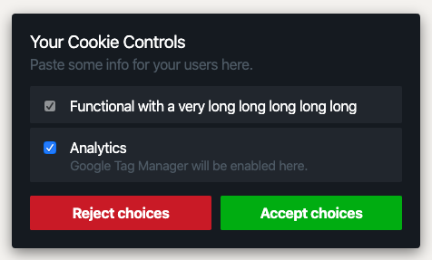

# GDPR Cookie Consent Banner 🍪

[Demo page with examples](https://muuvmuuv.github.io/gdpr-cookie-consent-banner/)

A full featured, small (8K) and easy to use library to show a cookie consent banner on
your website. It is fully tested and GDPR/DSGVO ready.



- [Installation](#installation)
- [The Why](#the-why)
- [How it works](#how-it-works)
- [How to use](#how-to-use)
  - [UMD](#umd)
  - [CommonJS](#commonjs)
- [Options](#options)
  - [Capability](#capability)
- [Advanced](#advanced)
  - [Cookies](#cookies)
- [Events](#events)
  - [onRejectEnd](#onrejectend)
    - [Example](#example)
  - [onAcceptEnd](#onacceptend)
    - [Example](#example-1)
  - [capability.onReject](#capabilityonreject)
    - [Example](#example-2)
  - [capability.onAccept](#capabilityonaccept)
    - [Example](#example-3)
  - [capability.onUpdate](#capabilityonupdate)
    - [Example](#example-4)
  - [capability.onValueChange](#capabilityonvaluechange)
    - [Example](#example-5)
- [Future ideas](#future-ideas)
- [Examples](#examples)
  - [Google Analytics](#google-analytics)

In use by this companies/people:

- [ADDITIVE GmbH](https://www.additive-net.de/de/)
- Open an issue, if you want to get added.

## Installation

```bash
npm install gdpr-cookie-consent-banner
```

## The Why

The company I've been working at had several discussion with their data protection
officer. In Germany and the EU we must do so called "opt-in" for all cookies. After
several weeks we came up with the following requirements: fully opt-in without any
preselected options (or option to preselect), a easy to enhance plugin and simple cookie
controls for customizability. The search began and very soon I have recognised that there
is no solution that fits all or only solutions that match one case or the many that do the
same. Most of the "gdpr complient" plugins had bad code, to difficult to change the HTML,
CSS or had no hooks to customize events. So that is why I created this.

## How it works

By default this plugin will create a banner with a functional capability, those are for
initial hide the banner and save user choices. If you add capabilities by yourself you
need to [add this capability again](src/lib/consent.js#L17-L32), because they will not be
merged with your config.

For the most, the example configuration with
[Google Analytics](src/docs/components/consent2/index.js) may be enough but if you need to
customize it feel free to do so. The plugin can be used for everything related to cookies
with consent opt-in/out. Go to the [advanced section](#advanced) to find out more.

## How to use

Examples (those you see in the demo) can be found here:
[`src/docs/components/consent(2)`](src/docs/components)

> NOTE: you must set all attributes like checked and disabled in JS as well, this plugin
> does not save your default settings nor override HTML attribute values for you.

### UMD

```html
<head>
  <link rel="stylesheet" href="/path/to/cookie-consent.css" />
  <script async defer src="/path/to/cookie-consent.umd.js"></script>
</head>
<body>
  <div
    id="cookiebanner"
    class="cookiebanner"
    aria-label="Edit your cookie settings"
    role="banner"
  >
    <div class="info">
      <div class="title">Your Cookie Controls</div>
      <div class="description">
        This displays the plugin with its default configuration.
      </div>
    </div>
    <div class="choices">
      <label class="choice" htmlFor="choice-functional2">
        <input type="checkbox" name="choice:functional" id="choice-functional2" checked />
        <div class="name">Functional</div>
      </label>
    </div>
    <div class="buttons">
      <button class="reject">Reject choices</button>
      <button class="accept">Accept choices</button>
    </div>
  </div>
  <div
    id="cookienotice"
    class="cookienotice"
    aria-label="Show the cookie settings again"
    role="button"
  >
    
  </div>
</body>
```

JavaScript:

```js
/* to modify cookies use this static class */
const Coookie = CookieConsent.cookie

window.consent = new CookieConsent({
  /* options */
})
```

### CommonJS

HTML:

Same as in UMD build.

JavaScript:

```js
import CookieConsent from 'gdpr-cookie-consent-banner'
// or
const CookieConsent = require('gdpr-cookie-consent-banner')

/* to modify cookies use this static class */
const Coookie = CookieConsent.cookie

window.consent = new CookieConsent({
  /* name: "my-consent-name" */
})
```

## Options

| Option         | Default                                                   | Type         | Description                                              |
| -------------- | --------------------------------------------------------- | ------------ | -------------------------------------------------------- |
| `name`         | `cookie-consent`                                          | string       | The name of your cookie.                                 |
| `banner`       | [src/lib/consent.js](src/lib/consent.js)@`defaultOptions` | HTMLElement  | The banner html element.                                 |
| `notice`       | [src/lib/consent.js](src/lib/consent.js)@`defaultOptions` | HTMLElement  | The notice html element.                                 |
| `linkOnly`     | `false`                                                   | boolean      | If the notice is a link or should be a floating element. |
| `onRejectEnd`  | [src/lib/consent.js](src/lib/consent.js)@`defaultOptions` | Function     | Called when all `onReject` events ran.                   |
| `onAcceptEnd`  | [src/lib/consent.js](src/lib/consent.js)@`defaultOptions` | Function     | Called when all `onAccept` events ran.                   |
| `capabilities` | see [Advanced](#advanced)                                 | Capability[] | Capabilities you want to apply.                          |

> NOTE: When you add `capabilities` you will override the `defaultOptions.capabilities`.
> When you don't need them OK but if you need the functionality from the `functional`
> capability copy it yourself into your code →
> [src/lib/consent.js](src/lib/consent.js)@`defaultOptions`.

### Capability

| Option           | Default                            | Type    | Description                                                                   |
| ---------------- | ---------------------------------- | ------- | ----------------------------------------------------------------------------- |
| `name`           | `functional`                       | string  | Capability name. Must match with checkbox name convention of `choice:<name>`. |
| `checked`        | `true`                             | boolean | Initial state of the checkbox. Must match with input attribute `checked`.     |
| `onReject`       | `(CookieConsent) => {...}`         | Event   | A callback if this capability gets rejected.                                  |
| `onAccept`       | `(CookieConsent) => {...}`         | Event   | A callback if this capability gets accepted.                                  |
| `onUpdate`       | `(CookieConsent, params) => {...}` | Event   | A callback if this capability gets updated.                                   |
| `onValueChanged` | `(CookieConsent, params) => {...}` | Event   | A callback if this capability value has changed.                              |

## Advanced

Have a look at the [demo](https://muuvmuuv.github.io/cookie-consent/) to see advanced
functionalities in action or the source of it, which you can find in
[`src/docs`](src/docs/). The docs are written in preact so the actual consent component
lives in `components` and includes a full Google Analytics example.

Every event hook has acccess to the `CookieConsent` instance and all its functions. Some
others also provide params. Below is a list of what is available with examples.

### Cookies

Inside `CookieConsent` lives a static class with some utilities to work with cookies. Here
is a list of all functions, also have a look at the [Google Analytics](#google-analytics)
example below.

- `set(...)`: set/create a new cookie
  - `name`
  - `value`
  - `domain`
  - `path`
  - `maxAge` (default: `7`)
  - `secure`
  - `sameSite` (default: `Lax`)
- `get(...)`: get a cookie by its name
  - `name`
- `getAll()`: get all cookies
- `find(...)`: find a cookie that match given string/regex
  - `regex`: string or regex, e.g. `g_` or `/^g_/g`
- `delete(...)`: delete a cookie by its name and options
  - `name`
  - `domain`
  - `path`
- `deleteAll()`: deletes all cookies
  - `domain`
  - `path`
- `clear(thatMatch, withOptions)`: clear all cookies that match given string/regex
  - `regex`: string or regex, e.g. `g_` or `/^g_/g`
  - `domain`
  - `path`

## Events

### onRejectEnd

- `consent` (CookieConsent): [`src/lib/consent.js`](src/lib/consent.js)

#### Example

```js
const onRejectEnd = (consent) => {
  window.location.reload()
}
```

### onAcceptEnd

- `consent` (CookieConsent): [`src/lib/consent.js`](src/lib/consent.js)

#### Example

```js
const onAcceptEnd = (consent) => {
  const choices = consent.getChoices()
  consent.saveUserOptions({ choices })
}
```

### capability.onReject

- `consent` (CookieConsent): [`src/lib/consent.js`](src/lib/consent.js)

#### Example

```js
const onReject = (consent) => {
  consent.removeUserOptions()
}
```

### capability.onAccept

- `consent` (CookieConsent): [`src/lib/consent.js`](src/lib/consent.js)

#### Example

```js
const onAccept = (consent) => {
  consent.saveUserOptions({ consented: true })
}
```

### capability.onUpdate

> Triggers when the choice is updated

- `consent` (CookieConsent): [`src/lib/consent.js`](src/lib/consent.js)
- `choice` (Choice): user choice for this capability

#### Example

```js
const onUpdate = (consent, { choice }) => {
  console.log('Value is:', choice)
}
```

### capability.onValueChange

> Triggers when the value has changed

- `consent` (CookieConsent): [`src/lib/consent.js`](src/lib/consent.js)
- `choice` (Choice): user choice for this capability

#### Example

```js
const onValueChange = (consent, { choice }) => {
  console.log('Value is:', choice)
}
```

## Future ideas

- [ ] Create plugin system, so Google Analytics does not need to be setup by someone
      itself
- [ ] Option to create the banner without defining the HTML somewhere
- [x] Allow notice to be just a link

## Examples

### Google Analytics

This is an example of a working Google Analytics configuration (as seen in the docs).

```js
window.onload = function() {
  window.consent = new CookieConsent({
    capabilities: [
      {
        name: 'functional',
        checked: true,
        onAccept: (consent) => {
          consent.saveUserOptions({ consented: true })
        },
      },
      {
        name: 'analytics',
        checked: false,
        onReject: () => {
          if (CookieConsent.cookie.find('_g')) {
            CookieConsent.cookie.clear('_g', '.' + window.location.hostname, '/')
          }
        },
        onAccept: () => {
          if (CookieConsent.cookie.find('ga-disable')) {
            return
          }
          const gaAddress = 'https://www.google-analytics.com/analytics.js'
          ;(function(i, s, o, g, r, a, m) {
            i['GoogleAnalyticsObject'] = r
            ;(i[r] =
              i[r] ||
              function() {
                ;(i[r].q = i[r].q || []).push(arguments)
              }),
              (i[r].l = 1 * new Date())
            ;(a = s.createElement(o)), (m = s.getElementsByTagName(o)[0])
            a.async = 1
            a.src = g
            m.parentNode.insertBefore(a, m)
          })(window, document, 'script', gaAddress, 'ga')
          ga('create', 'UA-XXXXXX-XX', window.location.hostname)
          ga('set', 'forceSSL', true)
          ga('set', 'anonymizeIp', true)
          ga('send', 'pageview')
        },
      },
    ],
  })
}
```

```html
<div
  id="cookiebanner"
  class="cookiebanner"
  aria-label="Edit your cookie settings"
  role="banner"
>
  <div class="info">
    <div class="title">Your Cookie Controls</div>
    <div class="description">Paste some info for your users here.</div>
  </div>
  <div class="choices">
    <label class="choice" for="choice-functional">
      <input
        type="checkbox"
        name="choice:functional"
        id="choice-functional"
        checked
        disabled
      />
      <div class="name">Functional with a very long long long long long</div>
    </label>
    <label class="choice" for="choice-analytics">
      <input type="checkbox" name="choice:analytics" id="choice-analytics" />
      <div class="name">Analytics</div>
      <p class="info">Google Tag Manager will be enabled here.</p>
    </label>
  </div>
  <div class="buttons">
    <button class="reject">Reject choices</button>
    <button class="accept">Accept choices</button>
  </div>
</div>
<div
  id="cookienotice"
  class="cookienotice"
  aria-label="Show the cookie settings again"
  role="button"
>
  
</div>
```
